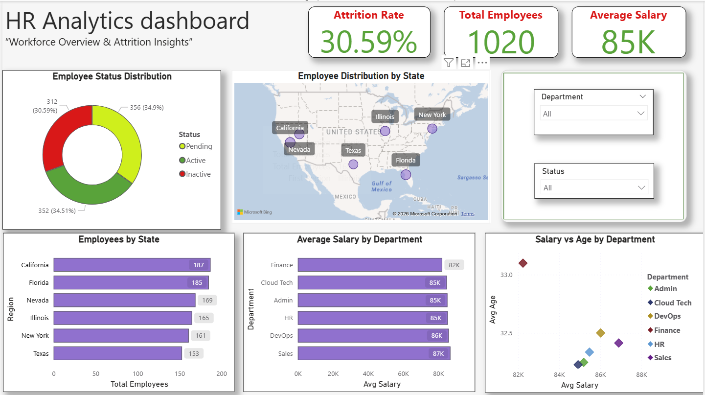

#  Power BI Dashboard Portfolio

This repository contains Power BI dashboard projects focused on business analytics and data visualization.

##  Projects Included

##  Dashboard Snapshots

### HR Analytics Dashboard

### Telco Churn Dashboard

### 1️ HR Analytics Dashboard

**Description:**  
This dashboard analyzes employee data to identify workforce trends, attrition patterns, and salary distribution insights.

**Key Insights:**
- Employee Attrition Rate Analysis
- Employee Distribution by State
- Average Salary by Department
- Salary vs Age Analysis
- Employee Status Distribution

  Project Link: [HR Analytics Dashboard](./HR-Analytics-Dashboard)

---

### 2️ Telco Customer Churn Dashboard

**Description:**  
This dashboard analyzes customer churn behavior in a telecom company to identify factors affecting customer retention.

**Key Insights:**
- Churn vs Non-Churn Analysis
- Monthly Charges Distribution
- Customer Demographics Analysis
- Contract Type Impact on Churn
- Tenure-Based Churn Patterns

  Project Link: [Telco Churn Dashboard](./Telco-Churn-Dashboard)

---

##  Tools Used

- Power BI
- Power Query
- DAX
- Data Visualization

---

##  Purpose

These dashboards were developed as part of my data analytics portfolio to demonstrate skills in:

- Data Cleaning
- Data Modeling
- Dashboard Design
- Business Insight Generation
- Data Visualization

---

##  Author

**Anandu Krishna**

Data Analyst | Data Scientist
