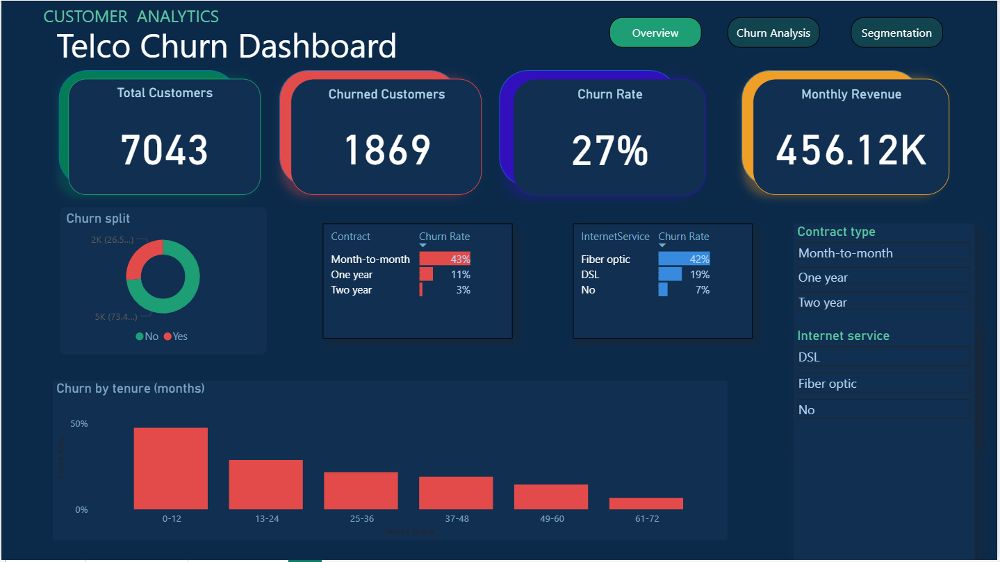
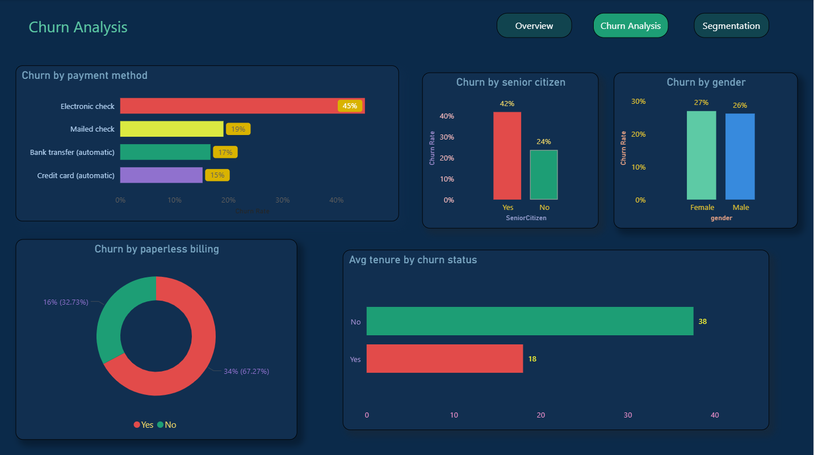
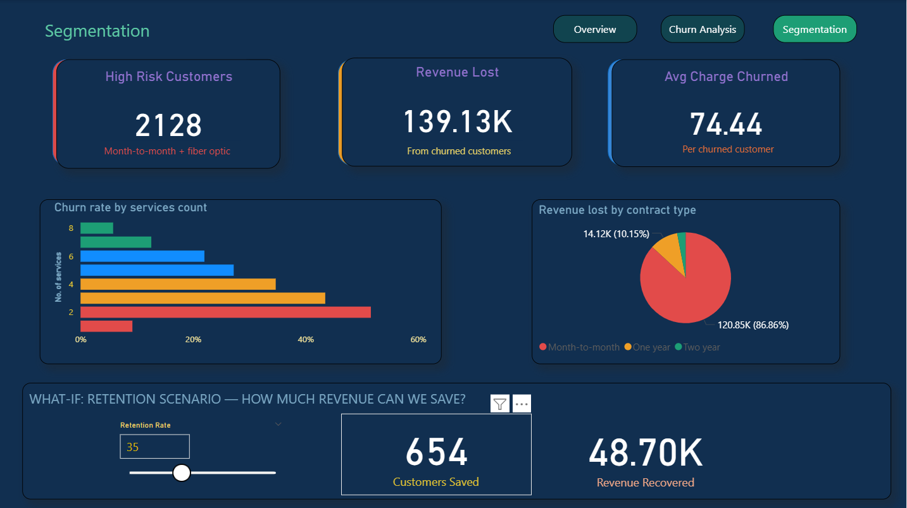

# Telco Customer Churn Dashboard — Power BI

##  Overview
An interactive 3-page Churn Analytics Dashboard built in Power BI analyzing customer data for **7,043 customers** across **3 contract types** and **3 internet service categories**.

This project demonstrates the full data analyst workflow — from messy raw data to a polished interactive dashboard with what-if scenario analysis.

---

##  Dashboard Preview






**Key Metrics:**
- Churn Rate: **26.54%**
- Churned Customers: **1,869**
- Monthly Revenue Lost: **$139K**
- High Risk Customers: **2,128**
- Avg Charge (Churned): **$74.44**

---

##  Project Workflow

### Phase 1 — Data Understanding
- Audited raw CSV dataset
- Identified **5 data quality issues**
- Reviewed columns:
  - customerID
  - gender
  - SeniorCitizen
  - tenure
  - MonthlyCharges
  - TotalCharges
  - Contract
  - InternetService
  - PaymentMethod
  - Churn

---

### Phase 2 — Data Cleaning (Power Query)
- Fixed null values in TotalCharges using custom column formula
- Converted TotalCharges from Text to Decimal Number
- Replaced SeniorCitizen 0/1 values with Yes/No for clarity
- Standardized 3-value service columns (replaced "No internet service" and "No phone service" with "No")
- Engineered **ChurnFlag** calculated column (1/0) for DAX calculations
- Engineered **Tenure Group** calculated column for tenure segmentation
- Engineered **Tenure Sort** calculated column for correct sort order
- Engineered **Services Count** calculated column counting total services per customer
- Verified **0% errors** using Column Quality view

---

### Phase 3 — DAX Measures

```DAX
Total Customers = COUNTROWS(Telco)

Churned Customers = 
CALCULATE(
    COUNTROWS(Telco),
    Telco[Churn] = "Yes"
)

Churn Rate = 
DIVIDE([Churned Customers], [Total Customers], 0)

Monthly Revenue = SUM(Telco[MonthlyCharges])

Revenue Lost = 
CALCULATE(
    SUM(Telco[MonthlyCharges]),
    Telco[Churn] = "Yes"
)

Avg Tenure = AVERAGE(Telco[tenure])

Avg Tenure Churned = 
CALCULATE(
    AVERAGE(Telco[tenure]),
    Telco[Churn] = "Yes"
)

Avg Tenure Retained = 
CALCULATE(
    AVERAGE(Telco[tenure]),
    Telco[Churn] = "No"
)

High Risk Customers = 
CALCULATE(
    COUNTROWS(Telco),
    Telco[Contract] = "Month-to-month",
    Telco[InternetService] = "Fiber optic"
)

Avg Charge Churned = 
CALCULATE(
    AVERAGE(Telco[MonthlyCharges]),
    Telco[Churn] = "Yes"
)

Revenue Recovered = 
[Revenue Lost] * (SELECTEDVALUE('Retention Rate'[Retention Rate Value]) / 100)
```

---

##  Pages & Visualizations

### Page 1 — Overview
- KPI Cards — Total Customers, Churned Customers, Churn Rate, Monthly Revenue
- Donut Chart — Churn split (retained vs churned)
- Table with Data Bars — Churn rate by contract type
- Table with Data Bars — Churn rate by internet service
- Column Chart — Churn rate by tenure group
- Slicers — Contract type & Internet service filtering

### Page 2 — Churn Analysis
- Horizontal Bar Chart — Churn rate by payment method
- Column Chart — Churn rate by senior citizen status
- Column Chart — Churn rate by gender
- Donut Chart — Churn by paperless billing
- Bar Chart — Avg tenure: churned vs retained customers

### Page 3 — Segmentation
- KPI Cards — High risk customers, Revenue lost, Avg charge churned
- Bar Chart — Churn rate by services count
- Pie Chart — Revenue lost by contract type
- What-if Parameter Slicer — Retention rate slider
- Card — Revenue recovered based on retention scenario

---

##  Key Findings
- Churn rate is **26.54%** — over 1 in 4 customers leaves
- **Month-to-month** contract customers churn at **42%** vs only 3% for two-year contracts
- **Fiber optic** internet customers churn at **41%** — highest of any service type
- **Electronic check** payment customers churn at **45%** — highest payment method
- **Senior citizens** churn at **42%** vs 24% for non-seniors
- Customers with **more services churn less** — loyalty effect confirmed
- Churned customers leave after avg **18 months** vs 38 months for retained
- **86%** of revenue loss comes from month-to-month contracts
- **2,128 high-risk customers** (month-to-month + fiber optic) represent the priority retention segment

---

##  Dataset
- Source: IBM Sample Data — Telco Customer Churn
- Rows: 7,043
- Columns: 21 (raw) → 26 (after engineering)

---

##  Tools Used
- Power BI Desktop
- Power Query
- DAX

---

##  Skills Demonstrated
- Data Cleaning & Transformation
- Calculated Column Engineering
- DAX Measure Creation
- Multi-page Dashboard Design
- KPI Visualization
- Customer Segmentation Analysis
- What-if Scenario Analysis
- Interactive Filtering & Slicers
- Business Insight Communication
